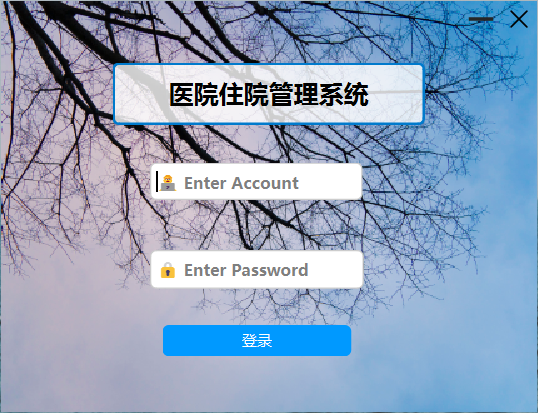
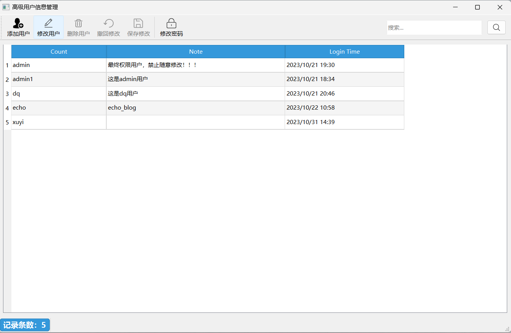
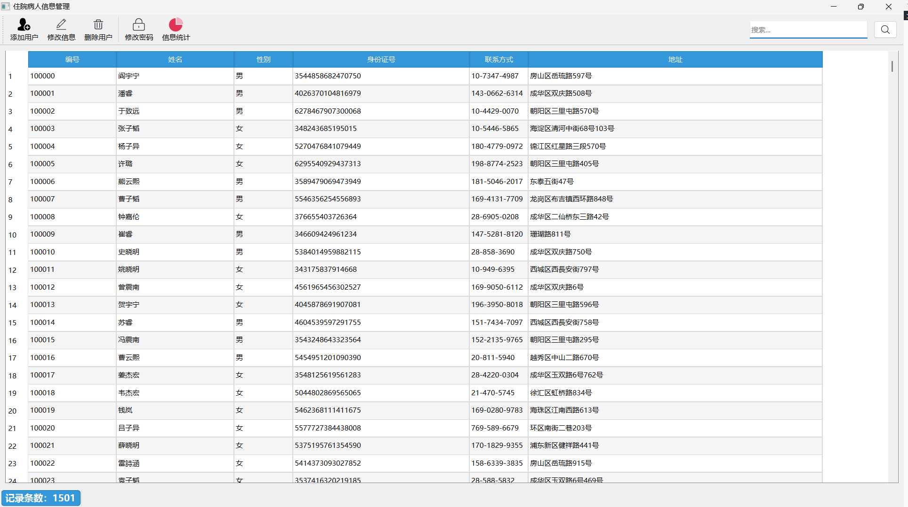
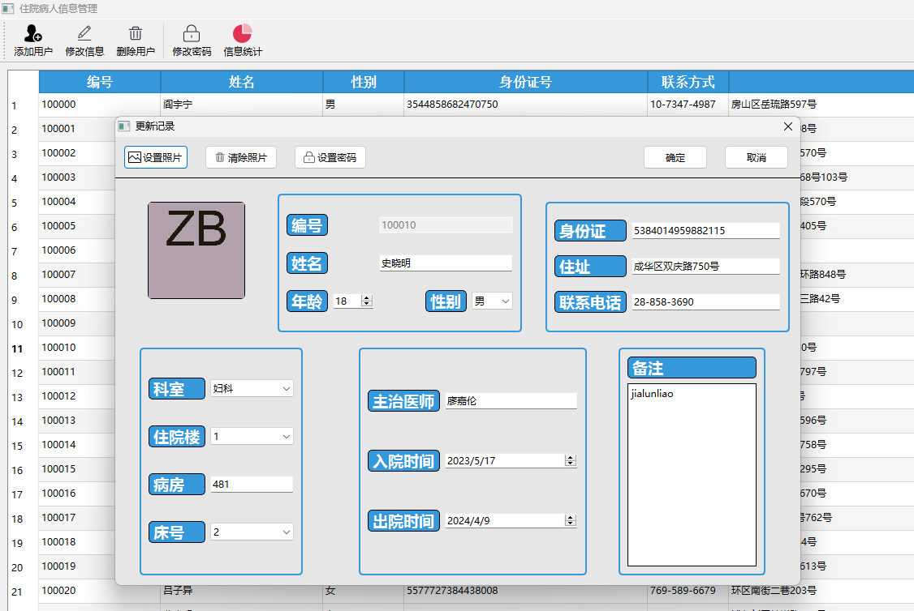
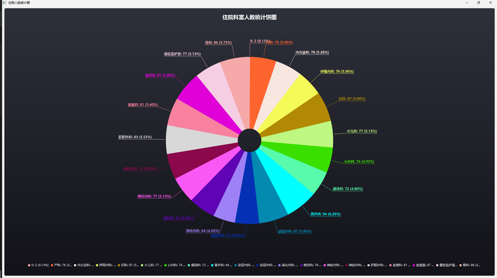
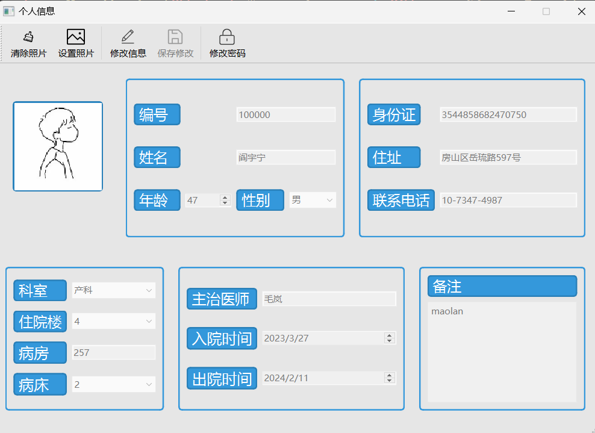
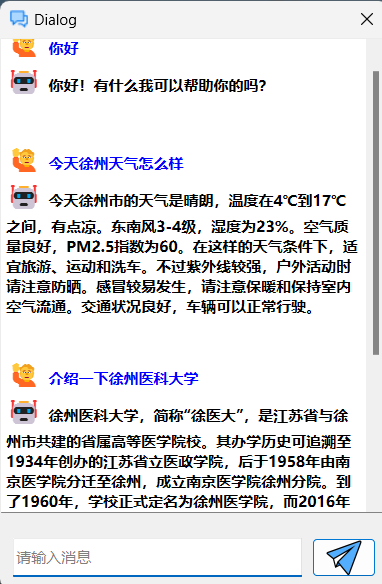
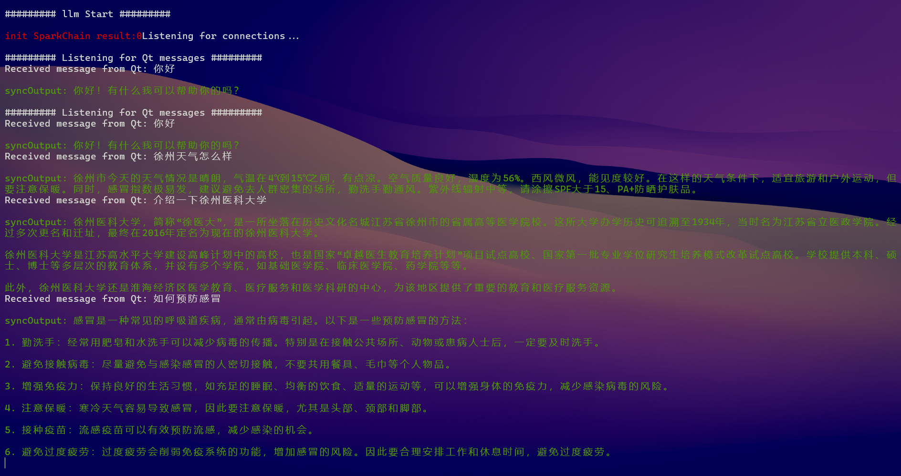

## 介绍

> 一款基于Qt的医院住院管理系统 

医院住院管理系统是一款基于 Qt 的医疗信息管理软件，使用 `C++` 实现。

用户需要通过密码验证进行登录，并且提供了高级管理员和信息管理员以及病人用户三种角色。

除此之外，各个主界面还接入了科大讯飞的星火3.0大模型，具有AI咨询功能。

因使用C++开发，具有极高效率和极小的内存占用。除此之外，还具有强大的跨平台能力，可在Linux系统下进行编译运行。


## 使用

由于第一次使用 `Qt` 写项目，相关文件以及配置信息过于杂乱

> 建议新建工程，复制相关UI文件、头文件和CPP文件，重新编译

### 项目文件

删除 `IMS.pro.user` 文件，用 `Qt Creator`  软件打开，选择编译配置信息

### Mysql配置

1. 使用版本为 `5.7` ，注意关闭Mysql 的 ssl连接。

   ```shell
    vim /etc/my.cnf 		# 打开mysql配置文件
    skip-ssl               # 添加此行，跳过ssl
    sudo service mysqld restart  # 重启mysql服务
    
    # 进入mysql，查看是否关闭，DISABLED即为关闭
    mysql> show variables like '%ssl%';
   +---------------+----------+
   | Variable_name | Value    |
   +---------------+----------+
   | have_openssl  | DISABLED |
   | have_ssl      | DISABLED |
   | ssl_ca        |          |
   | ssl_capath    |          |
   | ssl_cert      |          |
   | ssl_cipher    |          |
   | ssl_crl       |          |
   | ssl_crlpath   |          |
   | ssl_key       |          |
   +---------------+----------+
   9 rows in set (0.01 sec)
   ```

2. 新建数据库、用户 `ims`

   1. 登录到MySQL服务器：

   ```mysql
   mysql -u root -p
   ```

   输入MySQL的root用户密码以登录。

   2. 创建一个名为`ims`的数据库：

   ```mysql
   CREATE DATABASE ims;
   ```

   3. 创建一个名为`ims`的用户并分配密码。

   ```mysql
   CREATE USER 'ims'@'%' IDENTIFIED BY 'ims';
   ```

   4. 授予用户`ims` 对`ims`数据库的所有权限：

   ```mysql
   GRANT ALL PRIVILEGES ON ims.* TO 'ims'@'%';
   ```

   5. 刷新权限以使更改生效：

   ```mysql
   FLUSH PRIVILEGES;
   ```

   5. 退出MySQL提示符：

   ```mysql
   exit;
   ```

3. 导入 `ims.sql`

   打开 `SQL`文件夹，导入`ims.sql` ，修改相关数据库连接信息即可。默认数据库名、用户名和密码皆为`ims`。

   默认最高级用户 `admin` 密码为 `admin`


### 讯飞大模型服务器部署

前往讯飞官网：https://console.xfyun.cn/ 申请免费API，下载 `Linux SDK`，上传到服务器。

也可以使用我的文件夹 `HIMS_SparkV3.0`，**记得修改相关接口信息**。

建议参考官方文档：[Spark Linux SDK接入文档 | 讯飞开放平台文档中心 (xfyun.cn)](https://www.xfyun.cn/doc/spark/LinuxSDK.html)

> 注意开放相关端口，默认为 1024

```shell
# 进入目录
cd HIMS_Spark 

# 添加库环境
cd lib
cp libSparkChain.so /usr/lib

# 编译
cd ..
make

# 给与执行权限
chmod +x llm_server

# 使 llm_server 在后台运行，并将其输出重定向到一个名为 nohup.out 的文件
nohup ./llm_server &
```


## 相关界面

### 登录界面



`login.h` `login.cpp` `login.ui`

用户通过登录界面进入相关角色界面。通过SHA-256哈希算法对密码和盐值进行哈希处理并存储在Mysql数据库中。

通过比对账户不同进入不同界面。


### 最终管理员界面



  `adminwindow.h`   `adminwindow.cpp`   `adminwindow.ui` 

负责系统管理，包括添加、修改信息管理员等任务


### 信息管理员界面

`mainwindow.h` `mainwindow.cpp` `mainwindow.ui`

负责住院患者信息管理以及统计数据查看。包括患者账户密码修改。




`dialog.h` `dialog.cpp` `dialog.ui`

进行患者信息修改时弹出的对话框，包含患者相关信息。




`statistics.h` `statistics.cpp` `statistics.ui`

住院患者各科室人数统计图，目前仅有饼图




### 患者界面

`userwindow.h` `userwindow.cpp` `userwindow.ui`

患者登录后界面，可进行相关信息修改，包括患者照片、性别、年龄、身份证、地址以及联系方式。




### AI咨询界面

`aichat.h` `aichat.cpp` `aichat.ui`

`客户端`

​																		

`服务端`




## 其他文件

`Makefile.*` `.qtc_clang` `IMS.*`

相关配置文件，无需修改

`debug`

Debug 是调试版本，二进制文件带有调试信息，编译时不进行优化；

`release`

Release 是发行版本，不带有调试信息，针对运行速度对文件大小进行了优化；

`images.qrc`  `images`  

相关按钮、背景资源

`style.qrc`    `*.css`

相关控件美化CSS


### 资源文件

来自阿里巴巴矢量图标库